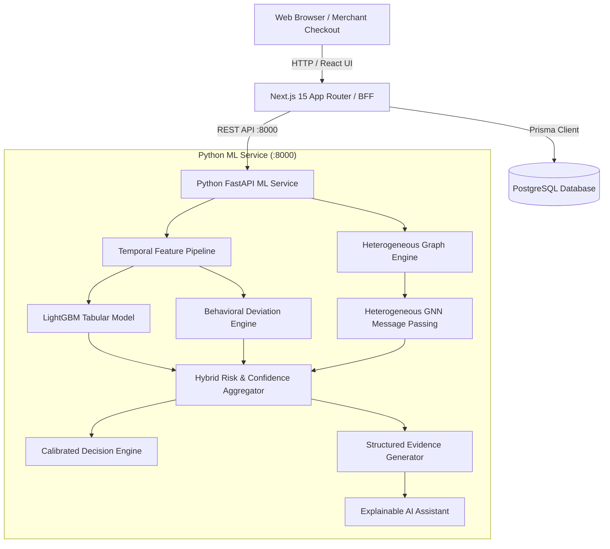

# PayPilot AI — System Architecture

## Overview

PayPilot AI is an enterprise-grade, explainable payment risk intelligence platform for merchants. It separates raw **Risk Probability** (the likelihood that a transaction is fraudulent) from **Information Confidence** (the density and completeness of available data, identity signals, and entity graphs).

---

## 1. Heterogeneous Entity Graph Schema

PayPilot AI models payment ecosystems as heterogeneous entity graphs with **7 node types** and **7 relation types**:

### Node Types
1. `Transaction`: The financial payment event ($Amount, Currency, Timestamp, Status, Risk Score$)
2. `Customer`: The account owner ($External ID, Email, Creation Date$)
3. `Device`: Physical client fingerprint ($Fingerprint, OS, Browser, Device Type$)
4. `Network`: Anonymity and routing profile ($IP, Network Type, ASN, Tor/VPN/Proxy status$)
5. `PaymentInstrument`: Tokenized payment reference ($Token, Brand, BIN, Last4$)
6. `Merchant`: The merchant entity receiving payment ($Merchant ID, Industry$)
7. `Email`: The domain and identity endpoint ($Email Hash, Disposable Flag$)

### Relational Edges
* `Customer` — `[MADE]` —> `Transaction`
* `Transaction` — `[USED_DEVICE]` —> `Device`
* `Transaction` — `[USED_PAYMENT]` —> `PaymentInstrument`
* `Transaction` — `[FROM_NETWORK]` —> `Network`
* `Transaction` — `[BELONGS_TO]` —> `Merchant`
* `Customer` — `[USES_EMAIL]` —> `Email`
* `Customer` — `[ASSOCIATED_WITH]` —> `CustomerDevice`

---

## 2. Dual-Metric Decision Philosophy ("NEW ≠ FRAUD")

Traditional rules blindly block new devices, new IPs, or first-time buyers. PayPilot AI implements a dual-metric paradigm:

| Metric | Range | Interpretation |
| :--- | :--- | :--- |
| **Risk Probability / Score** | `0.0 – 1.0` / `0 – 100` | Estimated probability of coordinated fraud, takeover, or abuse. |
| **Confidence Score** | `0.0 – 1.0` / `0 – 100%` | Measure of data completeness, historical depth, and entity graph density. |

### Decision Matrix
* **Risk < 30**: `APPROVE` (Low friction)
* **Risk >= 80 AND Confidence >= 0.75**: `BLOCK` (High-confidence confirmed attack)
* **Risk >= 60 OR (Risk >= 80 AND Confidence < 0.75)**: `REVIEW` (Low-confidence or first-time buyers are never blocked outright; routed for 2FA / manual analyst verification)

---

## 3. Resilient Failover & High Availability

If the Python FastAPI ML microservice is unreachable or experiencing network degradation:
1. Next.js automatically logs a graceful warning.
2. The embedded TypeScript Hybrid Risk Engine executes synchronous fallback evaluation.
3. Database persistence and UI interactivity continue without merchant interruption.
