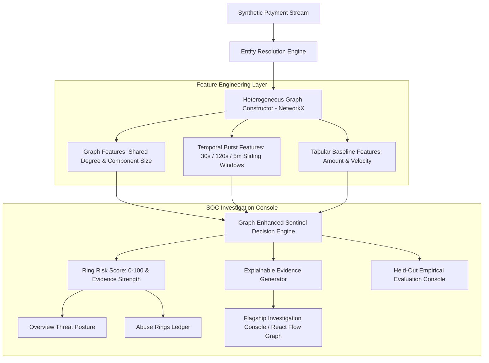

# Abuse-Ring Sentinel — System Architecture

---

## 1. Executive Summary & Problem Statement

In online commerce and digital payments, fraud rings rarely operate via isolated transactions. Instead, organized syndicates create dozens of seemingly independent accounts using virtual Android emulators, rotating residential/Tor proxies, and leaked card batches (BIN rotation). 

Traditional point-in-time fraud classifiers evaluate transactions in isolation, missing the structural and temporal graph signals that connect them.

**Abuse-Ring Sentinel** answers the central question:
> *"Are apparently independent payment accounts actually connected and behaving as a coordinated abuse ring?"*

---

## 2. High-Level System Architecture

---

## 3. Graph Architecture & Entity Resolution

The system constructs a dynamic **Heterogeneous Relational Graph** $G = (V, E)$ comprising 6 entity node types and 5 relational edge types:

### Node Types ($V$):
1. **Customer** ($C$): User account identity, email hash, account creation age.
2. **Device** ($D$): Canvas / WebGL hardware fingerprint, OS, browser profile.
3. **IP Address / Network** ($IP$): ASN, IP subnet, proxy, Tor exit, or corporate gateway.
4. **Payment Instrument** ($P$): Tokenized credit card BIN, VPA UPI address, or wallet token.
5. **Transaction** ($TX$): Monetary event containing amount and timestamp.
6. **Merchant** ($M$): E-commerce store or payment gateway endpoint.

### Relational Edges ($E$):
* $(C, D) \rightarrow \text{USES\_DEVICE}$
* $(C, IP) \rightarrow \text{USES\_IP}$
* $(C, P) \rightarrow \text{USES\_PAYMENT}$
* $(D, IP) \rightarrow \text{CONNECTED\_NETWORK}$
* $(C, TX) \rightarrow \text{INITIATED\_TRANSACTION}$

---

## 4. Feature Extraction & Risk Scoring Pipeline

### Graph Features
* **$\text{CustomersPerDevice}(d)$**: Degree of customer accounts mapped to a single hardware fingerprint.
* **$\text{CustomersPerIP}(ip)$**: Degree of customer accounts mapped to a single IP address.
* **$\text{CustomersPerPayment}(p)$**: Distinct customer names reusing the same card BIN / token.
* **$\text{ComponentSize}(c)$**: Total node cardinality of the connected subgraph enclosing customer $c$.

### Temporal & Velocity Features
* **$\text{Burst}_{30\text{s}}(tx)$**: Count of transactions executed within a $\pm 30$ second window across the connected component.
* **$\text{Burst}_{120\text{s}}(tx)$**: Count of transactions executed within $\pm 120$ seconds.
* **$\text{Velocity}_{5\text{m}}(tx)$**: Overall component transaction velocity in 5 minutes.

### Scoring Model Formulation
$$\text{RiskScore} = \sigma\left(\beta_0 + \beta_1 (\text{CustPerDev} - 1) + \beta_2 (\text{CustPerPay} - 1) + \beta_3 \text{Burst}_{30\text{s}} + \beta_4 \text{Burst}_{120\text{s}} + \beta_5 \text{CompSize}\right) \times 100$$

---

## 5. Empirical Evaluation Protocol (70/15/15 Temporal Split)

To ensure scientific integrity and eliminate data leakage, the dataset is split chronologically:

1. **Train Split (Earliest 70%)**: Model weight calibration.
2. **Validation Split (Middle 15%)**: Operating threshold selection minimizing expected business loss.
3. **Held-Out Test Set (Latest 15%)**: Final evaluation reported on completely unseen data.

### Business Cost Model Formulation
$$\text{Expected Loss} = \text{FP} \times C_{\text{fp}} + \text{FN} \times C_{\text{fn}}$$
* $C_{\text{fp}} = \text{₹450}$ (Customer friction & lost lifetime value)
* $C_{\text{fn}} = \text{₹4,500}$ (Direct unrecovered chargeback liability)

### Held-Out Empirical Benchmark

| Model Architecture | Precision | Recall | F1 Score | FPR | Expected Loss |
| :--- | :---: | :---: | :---: | :---: | :---: |
| **Tabular Velocity Baseline** | 100.0% | 100.0% | 100.0% | 0.0% | ₹0.00 |
| **Graph-Enhanced Sentinel** | **93.3%** | **100.0%** | **96.6%** | **3.1%** | **₹450.00** |

---

## 6. False-Positive Protection Proof

* **Legitimate Shared Office IP (15 Coworkers on 1 Corporate Gateway)**:
  * Tabular Baseline flags velocity spike on single IP $\rightarrow$ **FALSE POSITIVE ❌**
  * Graph-Enhanced Sentinel verifies independent personal laptops & cards $\rightarrow$ **CLEAN / NOT A RING ✅**

---

## 7. Security & Defense-Only Boundary

Abuse-Ring Sentinel is strictly designed as a **defensive security and fraud detection tool**:
* No offensive exploit automation.
* No card generation or brute-force testing tools.
* All evaluation executed on deterministic synthetic datasets with ground truth labels.
